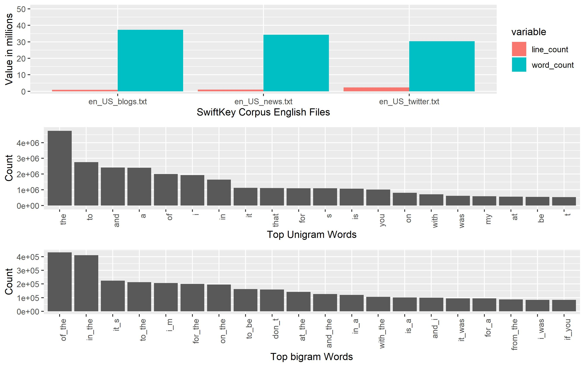
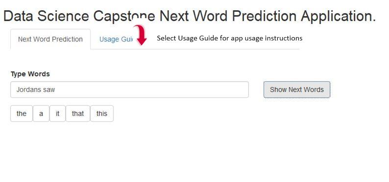

Data Science Capstone Next Word Prediction Application
========================================================
author: Venkata Vasam 
date: 
autosize: true

<!--

Does the link lead to a 5 slide deck on R Pubs?
Does the slide deck contain a description of the algorithm used to make the prediction?
Does the slide deck describe the app, give instructions, and describe how it functions?
How would you describe the experience of using this app?
Does the app present a novel approach and/or is particularly well done?
Would you hire this person for your own data science startup company?

-->

Overview
========================================================

* Text Documents Corpus Source : https://d396qusza40orc.cloudfront.net/dsscapstone/dataset/Coursera-SwiftKey.zip
* Exploratoray Data Analysis
* Next Prediction Model Algoritham -Kneser-Ney Smoothing
  + Quanteda Natural Language Processing (N-Grams)

* Data Science Capstone Next Word Prediction Application
* References

Exploratory Data Analysis
========================================================
* Read files and create line count and word counts
*  Quanteda Natural Language Processing (NLP)library API for corpus, tokens, N-Grams and Document Feature Matrix

Next Prediction Model Algorithm -Kneser-Ney Smoothing
========================================================
* N-Gram models for unigram, bigram and trigram with counts and probability.
* Probability of next word using previous word(Markov) and Normalized Maximum Likelihood Estimation : $$P(w_n/w_{1}^{n-1})=P(w_n/w_{n-1})=C(w_{n-1}w_n)/C(w_{n-1})$$
* Interploated Kneser-Ney smoothing :$$P_{KN}(w_i/w_{i-1}=max(c(w_{i-1}w_i)-d,0)/c(w_{i-1})+\lambda(w_{i-1})P_{continuation}(w_i))$$

  $$\lambda(w_{i-1})=d/c(w_{i-1}) | {w:c(w_{i-1,w}) >0 }| , d=0.75$$
  
Application Usage Instructions
========================================================

The application URL is: https://vvasam.shinyapps.io/dscs_shinyapp/

References 
========================================================

1. Text mining infrastructure in R
   https://www.jstatsoft.org/article/view/v025i05

2. CRAN Task View: Natural Language Processing
        https://cran.r-project.org/web/views/NaturalLanguageProcessing.html
        
3.Speech and Language Processing (3rd ed. draft)
  https://web.stanford.edu/~jurafsky/slp3/
  N-GRAMS
    https://web.stanford.edu/~jurafsky/slp3/3.pdf
    
4. Data Science Specialization Community Mentor Content Repository
  https://github.com/lgreski/datasciencectacontent
  
5. The Elements of Statistical Learning
https://web.stanford.edu/~hastie/ElemStatLearn/

6. Quanteda: Quantitative Analysis of Textual Data
https://quanteda.io/
