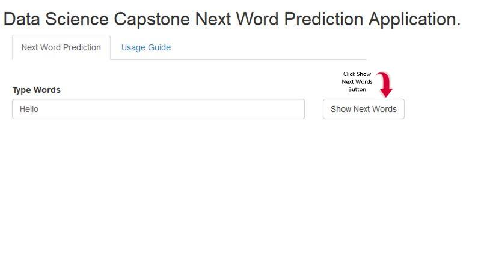
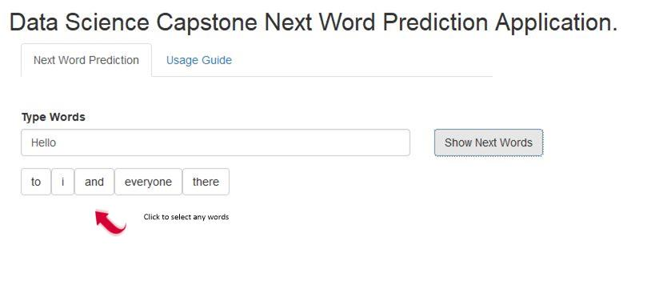
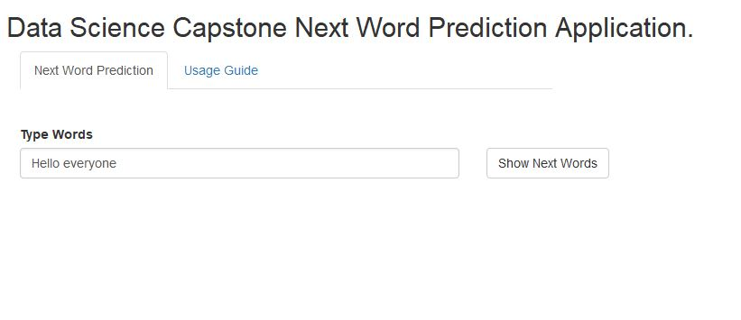
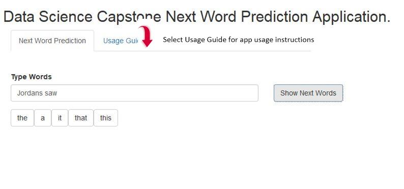

```{r setup, include=FALSE}
knitr::opts_chunk$set(echo = TRUE)
```
&nbsp;
&nbsp;

The Next Word Prediction app is developed to predict next word for the words from blogs, news and Twitter files. The model for the corpus text files is created using natural language processing (NLP) techniques such as N-Grams and Kneser-Ney smoothing, back off and interpolation. 

The source files for the corpus is taken from: https://d396qusza40orc.cloudfront.net/dsscapstone/dataset/Coursera-SwiftKey.zip


## Application Main Page

The following shows the first page of application. The main page shows the text input area with default word "Hello". Click "Show Next Words" button to see predicted next word.




## Select Next Word 

The following shows the sample screen of predicted next words for the last word entered in text input area. Click any of the words to add it to the input text.


The following screen shows the selected word.




## Usage Guide Tab

As shown below click "Usage Guide" tab to see these instructions. Click "Next Word Prediction" tab to go back to application main page.



## The Application URL

The application URL is : https://vvasam.shinyapps.io/dscs_shinyapp/

